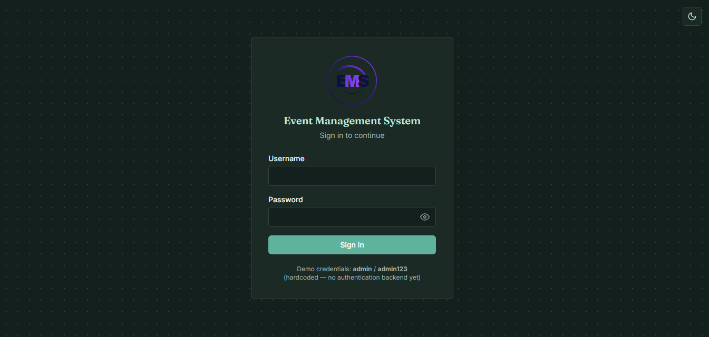
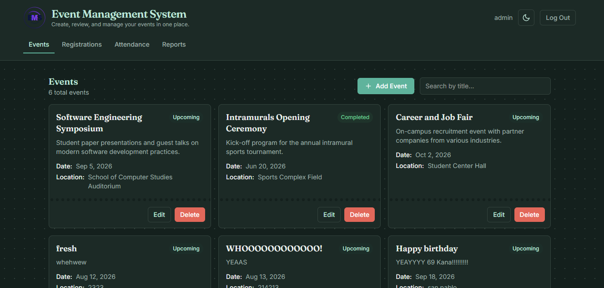
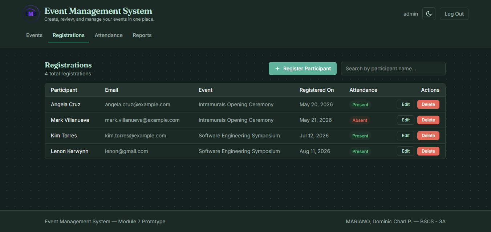
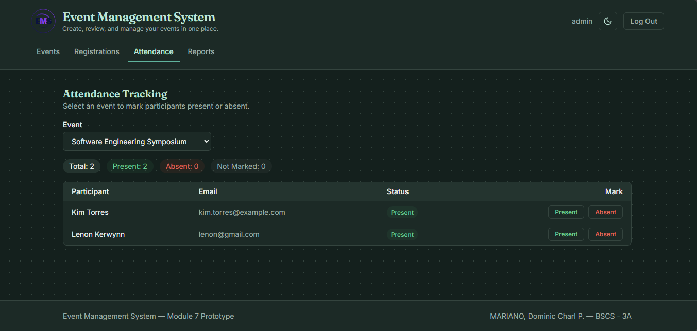
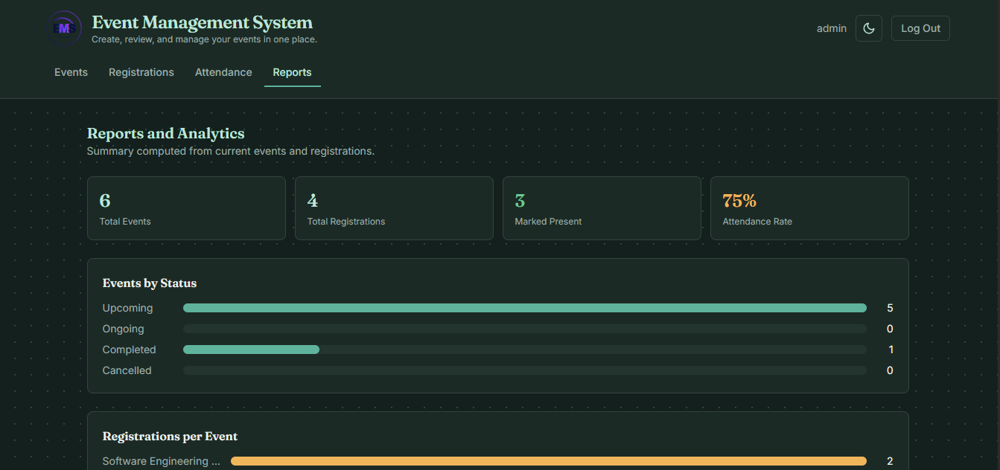

# 📋 Event Management System — Module 7

> **Vue.js Frontend Prototype** for managing campus events, participant registrations, and attendance tracking.

---

## 👤 Student Information

| Field             | Details                                  |
| ----------------- | ---------------------------------------- |
| **Student Name**  | MARIANO, Dominic Charl P.                |
| **Course & Section** | BSCS 3A                              |
| **Subject**       | Software Engineering 1                   |
| **Module**        | Module 7 — Vue.js Scaffold              |
| **Instructor**    | Patrick Jason L. Torres                  |

---

## 📝 System Description

The **Event Management System** is a single-page application (SPA) built with Vue.js that provides a centralized interface for creating, reviewing, and managing campus events. It serves as the frontend prototype for the architectural design planned in Module 6.

### Selected Module 6 Entity

The primary entity carried over from Module 6 is the **Event** entity, which represents campus events that can be created, read, updated, and deleted (CRUD). Each Event record contains:

- `id` — unique identifier
- `title` — event name
- `description` — brief summary
- `eventDate` — scheduled date
- `location` — venue
- `status` — current state (Upcoming, Ongoing, Completed, Cancelled)
- `createdAt` / `updatedAt` — timestamps

---

## ✅ List of Implemented Features

### Event Management (CRUD)
- Create new events via modal form
- View all events as responsive card grid
- Edit existing events with confirmation dialog
- Delete events (cascading removal of related registrations)
- Search/filter events by title
- Status badges with color-coded indicators

### Participant Registration (CRUD)
- Register participants to specific events
- View all registrations in a searchable list
- Edit registration details with confirmation
- Delete registrations with confirmation dialog
- Linked event dropdown for registration

### Attendance Tracking
- Select an event to view its registered participants
- Mark individual participants as **Present** or **Absent**
- Real-time summary counters (Total, Present, Absent, Not Marked)
- Responsive layout: table on desktop, cards on mobile

### Reports & Analytics Dashboard
- Total event and registration counts
- Event status breakdown with visual bars
- Attendance rate statistics per event
- Upcoming events quick-view list

### Authentication (Prototype)
- Login gate with hardcoded credentials (`admin` / `admin123`)
- Session persistence via localStorage
- Log Out functionality

### Dark Mode
- Toggle between light and dark themes
- Flash-of-unstyled-content prevention via inline script
- Theme preference saved in localStorage

### Responsive Design
- Mobile-first layout with hamburger navigation
- Stacked card views on small screens
- Desktop table views on larger screens
- Full-width action buttons on mobile

---

## 🛠 Technologies Used

| Technology          | Purpose                                          |
| ------------------- | ------------------------------------------------ |
| **Vue.js 3**        | Reactive frontend framework (Composition API)    |
| **Vite**            | Fast development server and build tool           |
| **Tailwind CSS 4**  | Utility-first CSS framework                      |
| **JavaScript (ES6+)** | Application logic and data handling            |
| **localStorage API** | Client-side data persistence                    |
| **Google Fonts**    | Typography (Fraunces + Inter)                    |
| **GitHub Actions**  | CI/CD build verification on push                 |

---

## 🚀 Installation and Run Instructions

### Prerequisites

- **Node.js** v18 or later — [Download here](https://nodejs.org/)
- **npm** (comes bundled with Node.js)
- **Git** — [Download here](https://git-scm.com/)

### Setup

```bash
# 1. Clone the repository
git clone https://github.com/charl1107/mariano-module7-vue-system.git

# 2. Navigate into the project directory
cd mariano-module7-vue-system

# 3. Install dependencies
npm install

# 4. Start the development server
npm run dev
```

The app will be available at `http://localhost:5173` (default Vite port).

### Build for Production

```bash
npm run build
```

The production-ready files will be output to the `dist/` folder.

### Login Credentials (Prototype)

| Username | Password   |
| -------- | ---------- |
| `admin`  | `admin123` |

---

## 💾 Explanation of localStorage

This application uses the browser's **`localStorage` API** as its data persistence layer instead of a traditional backend database. localStorage is a key-value store built into every modern web browser that persists data even after the browser tab or window is closed.

### How It Works in This System

The application uses **five localStorage keys**:

| Key                            | Purpose                                    |
| ------------------------------ | ------------------------------------------ |
| `event-management-events`      | Stores the array of event objects as JSON   |
| `event-management-registrations` | Stores participant registration records  |
| `event-management-auth`        | Stores current login session info          |
| `event-management-theme`       | Stores dark/light mode preference          |
| `event-management-nav`         | Stores the last active navigation tab      |

### Data Flow

1. **First Load** — If no saved data is found, the app seeds localStorage with sample events and registrations so the interface is not empty.
2. **CRUD Operations** — Every create, update, or delete action immediately writes the updated array back to localStorage via `JSON.stringify()`.
3. **Page Reload** — On mount, the app reads from localStorage via `JSON.parse()` and restores the previous state, including theme, auth, and active tab.

### Why localStorage?

- **No backend needed** — This is a frontend prototype; localStorage lets us demonstrate full CRUD without a server.
- **Instant persistence** — Data survives page refreshes and browser restarts.
- **Simple API** — `getItem()`, `setItem()`, and `removeItem()` are straightforward to use.

### Limitations of localStorage

- **~5 MB limit** per origin — not suitable for large datasets.
- **No multi-user support** — data is local to the browser.
- **No encryption** — sensitive data should not be stored here.
- **Synchronous** — large reads/writes can block the main thread.

---

## 🔗 Connection Between Module 6 and Module 7

### Module 6 — Architectural Design

In Module 6, the **Event Management System** was designed at the architectural level. The deliverables included:

- System overview and problem statement
- Architectural patterns (e.g., layered architecture)
- Entity-Relationship diagrams featuring the **Event** entity
- Use case diagrams for event CRUD, registration, and attendance
- Data flow and component diagrams
- Non-functional requirements (performance, security, usability)
- Architectural limitations and constraints

📎 **Module 6 Repository:** [charl1107/mariano-module6-architecture](https://github.com/charl1107/mariano-module6-architecture)

### Module 7 — Vue.js Frontend Prototype

Module 7 brings the Module 6 architecture to life as a working frontend prototype:

| Module 6 Design Element         | Module 7 Implementation                              |
| ------------------------------- | ----------------------------------------------------- |
| Event Entity (ER Diagram)       | `SAMPLE_EVENTS` data model with full CRUD operations  |
| Registration Entity             | `SAMPLE_REGISTRATIONS` with linked event references   |
| Event Management Use Case       | `EventForm`, `EventList`, `EditEventModal` components |
| Registration Use Case           | `RegistrationForm`, `RegistrationList` components     |
| Attendance Tracking Use Case    | `AttendanceTracker` component with status marking     |
| Reporting Use Case              | `ReportsView` component with analytics dashboard      |
| Layered Architecture            | Separation into components, state management, and UI  |
| Data Persistence Layer          | localStorage as prototype data layer                  |
| Authentication Requirement      | `LoginView` with session management                   |
| UI/UX Non-functional Requirement | Dark mode, responsive design, modal confirmations    |

The architectural constraints noted in Module 6 (e.g., no backend database) are directly reflected in Module 7's use of localStorage as a temporary data store.

---

## 📸 Application Screenshots

### Login Page


### Events Dashboard


### Registrations Dashboard


### Attendance Tracker


### Reports Dashboard


---

## ⚠️ Known Limitations

1. **No Real Backend** — Data is stored only in the browser's localStorage. There is no server, database, or API integration.
2. **Single-User Only** — The app runs entirely in one browser session; there is no multi-user or real-time collaboration support.
3. **Hardcoded Credentials** — Authentication uses a fixed username/password (`admin`/`admin123`) with no registration or password recovery.
4. **No Input Sanitization** — User inputs are not sanitized or validated beyond basic required-field checks.
5. **Storage Limit** — localStorage is capped at approximately 5 MB, so the system cannot handle a large volume of events or registrations.
6. **No Data Export** — There is no option to export data to CSV, PDF, or any external format.
7. **No Pagination** — All records are displayed at once; large datasets could degrade performance.

---

## 🔮 Proposed Future Improvements

1. **Backend Integration** — Connect to a REST API (e.g., Node.js + Express) with a proper database (MySQL or MongoDB) for real data persistence.
2. **User Authentication System** — Implement JWT-based authentication with registration, password hashing, and role-based access control (Admin, Organizer, Participant).
3. **Real-Time Updates** — Use WebSockets or Firebase for live event updates and attendance tracking across multiple users.
4. **Data Export** — Add export functionality for event reports in CSV and PDF formats.
5. **Pagination & Search Enhancement** — Implement server-side pagination, sorting, and advanced filtering (by date, status, location).
6. **Email Notifications** — Send automated emails for registration confirmations, event reminders, and status changes.
7. **File Uploads** — Allow event organizers to upload event banners, venue maps, and participant documents.
8. **Mobile App** — Develop a companion mobile app using Flutter or React Native for on-the-go attendance marking.
9. **QR Code Attendance** — Generate QR codes for events that participants can scan to auto-mark attendance.
10. **Calendar Integration** — Sync events with Google Calendar or Outlook for better scheduling visibility.

---